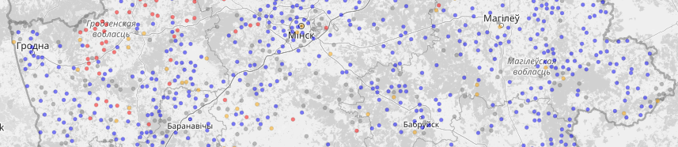

## Аб праекце

**[Secret Spot](https://secret-spot-by.com/)** гэта спроба знайсці і прывесці да адзінага выгляду інфармацыю 
пра цікавыя прыродныя мясціны Беларусі.

Ідэя праекту з'явілася ў моманты планавання маршрутаў па Беларусі, 
пошуку цікавых "сакрэтных" мясцін, якія не трапляюць у папсовыя інстаграмы.

На дадзены момант праект мае некалькі галоўных напрамкаў

## Пошук інфармацыі

Мы выкарыстоўваем [Форум Глобуса Беларусі](https://fgb.by/) і [OSM](https://www.openstreetmap.org/) 
як крыніцы інфармацыі для папаўнення базы ведаў. 

падрабязней

## Фармалізацыя інфармацыі

База ведаў — гэта сэрца **[Secret Spot](https://secret-spot-by.com/)**. Дадзеныя захоўваюцца ў выглядзе тэкставых YAML 
файлаў вызначанага фармату, што дае магчымасць машыннай апрацоўкі фактаў аб аб'ектах.

падрабязней

## Распаўсюджванне дадзеных

Мы даем магчымасць выкарыстоўвання як базы ведаў, так і альтэрнатыўных фарматаў ужо апрацаваных дадзеных:

- [тайлы](docs/share/tiles) для выкарыстоўвання як map overlay пры планаванні маршрутаў
- [тэкставыя KML/GPX фарматы](docs/share/text) для выкарыстоўвання ў навігацыйных праграмах

падрабязней

## Актуалізацыя дадзеных

Прыродныя аб'екты змяняюцца з часам: дрэвы падаюць, крыніцы высыхаюць, камяні перавозяцца. Пакуль мы выкарыстоўваем 
ў асноўным [агульнавядомыя крыніцы](docs/data-source) для падтрымання дадзеных у актуальным стане, 
але калі вы знайшлі памылку ці дадатковыя крыніцы інфармацыі, то мы будзем удзячны.

падрабязней

