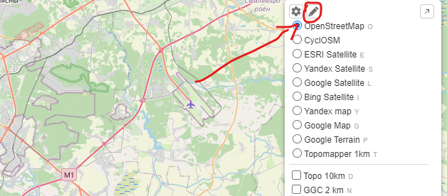
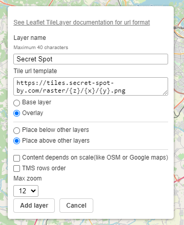

# nakarte.me

## 1. Ціснем `Add custom layer`

## 2. Запаўняем форму

   |                   |                                                                       |                                                                                   |
   |-------------------|-----------------------------------------------------------------------|-----------------------------------------------------------------------------------|
   | Layer name        | `Secret Spot`                                                         |                                                                                   |
   | Tile url template | `https://tiles.secret-spot-by.com/latest/raster/base/{z}/{x}/{y}.png` | прыклад, выкарыстоўвайце канфігурацыю [адсюль]() |
   | Type              | `Overlay`                                                             |                                                                                   |
   | Position          | `Place above other layers`                                            |                                                                                   |
   | Max zoom          | `14`                                                                  | прыклад, выкарыстоўвайце канфігурацыю [адсюль]() |

## 3. Ціснем "Add layer"

Прыклад канфігурацыі [nakarte.me](https://nakarte.me/#m=7/53.64138/28.64136&l=O/-cseyJuYW1lIjoiU2VjcmV0IFNwb3QiLCJ1cmwiOiJodHRwczovL3RpbGVzLnNlY3JldC1zcG90LWJ5LmNvbS9sYXRlc3QvcmFzdGVyL2Jhc2Uve3p9L3t4fS97eX0ucG5nIiwidG1zIjpmYWxzZSwic2NhbGVEZXBlbmRlbnQiOnRydWUsIm1heFpvb20iOjE0LCJpc092ZXJsYXkiOnRydWUsImlzVG9wIjp0cnVlfQ==)

